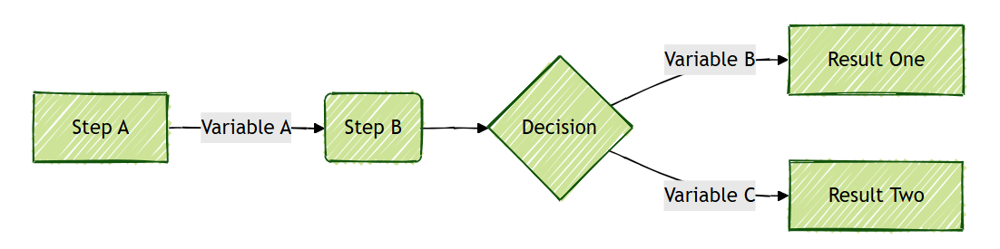

# Documentation Diagram Guideline

Standards for creating and maintaining visual diagrams in documentation.

## Draw.io Guidelines

- Use [draw.io](https://www.drawio.com/)
- Prefer icons from [Clarity Icons](https://clarity.design/documentation/icons/shapes)
  - If unavailable, use framed text
- Save in editable formats (`.drawio.png`, `.drawio.svg`) for future modifications
- Example diagram embedded in Markdown:


## Mermaid Guidelines

- [Mermaid](https://mermaid.js.org/syntax/flowchart.html) is ideal for flowcharts, process diagrams, decision trees, and logic flows, with support for direct embedding in `Markdown`
- [Mermaid Live Editor](https://mermaid.live/) — browser-based editor for quick edits
- [Mermaid Chart Extension for VS Code](https://marketplace.visualstudio.com/items?itemName=MermaidChart.vscode-mermaid-chart) — live preview and editing in IDE
- Use clear labels, consistent structure, and directional arrows  
- Keep syntax minimal and readable 
- Example Markdown syntax:

  ```markdown
  ---
  config:
    look: handDrawn
    theme: forest
  ---
  flowchart LR
      A[Step A] -->|Variable A| B(Step B)
      B --> C{Decision}
      C -->|Variable B| D[Result One]
      C -->|Variable C| E[Result Two]
  ```

- Renders the following diagram:


