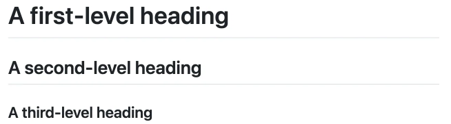
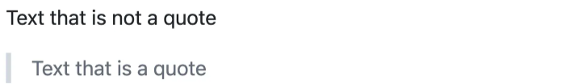

# Introduction

## What is Markdown?

Markdown is a plain text format for writing structured documents, based on conventions for indicating formatting in email and usenet posts. It was developed by John Gruber (with help from Aaron Swartz) and released in 2004 

In the next decade, dozens of implementations were developed in many languages. 

Markdown is an easy-to-read, easy-to-write language for formatting plain text. Websites like Reddit, StackOverflow, and GitHub had millions of people using Markdown. And Markdown started to be used beyond the web, to author books, articles, slide shows, letters, and lecture notes.

In this guide, you'll learn some basic/advanced formatting features by creating or editing a markdown file.

## Basic writing and formatting syntax

### Headings

To create a heading, add one to six <kbd>#</kbd> symbols before your heading text. The number of <kbd>#</kbd> you use will determine the hierarchy level and typeface size of the heading.

```markdown
# A first-level heading
## A second-level heading
### A third-level heading
```



## Styling text

You can indicate emphasis with bold, italic, strikethrough, subscript, or superscript text in comment fields and `.md` files.


| Style                  | Syntax                | Example                                  | Output                                    |
| ---------------------- | --------------------- | ---------------------------------------- | ----------------------------------------- |
| Bold                   | `** **` or `__ __`    | `**This is bold text**`                  | **This is bold text**                     |
| Italic                 | `* *` or `_ _`        | `_This text is italicized_`              | _This text is italicized_                 |
| Strikethrough          | `~~ ~~` or `~ ~`      | `~~This was mistaken text~~`             | ~~This was mistaken text~~                |
| Bold and nested italic | `** **` and `_ _`     | `**This text is _extremely_ important**` | **This text is _extremely_ important**    |
| All bold and italic    | `*** ***`             | `***All this text is important***`       | ***All this text is important***          | 
| Inline code            | `` ` ` `` (single `)  | `` `systemctl status nginx` ``           | `systemctl status nginx`                  |
| Subscript              | `<sub> </sub>`        | `This is a <sub>subscript</sub> text`    | This is a <sub>subscript</sub> text       |
| Superscript            | `<sup> </sup>`        | `This is a <sup>superscript</sup> text`  | This is a <sup>superscript</sup> text     |
| Underline              | `<ins> </ins>`        | `This is an <ins>underlined</ins> text`  | This is an <ins>underlined</ins> text     |

## Code blocks (triple backticks)
To format code or text into its own distinct block, use triple backticks.
Use triple backticks to format commands or config as a standalone block.  
You can add a language hint for syntax highlighting (e.g., `bash`, `yaml`).

**Ansible playbook example:**

```yaml
- name: Ensure Nginx is installed
    apt:
    name: nginx
    state: present
    update_cache: true

- name: Ensure Nginx is enabled and running
    service:
    name: nginx
    state: started
    enabled: true
```

**Linux example:**

```shell
# Update packages (Debian/Ubuntu)
sudo apt update && sudo apt upgrade -y

# Check disk usage
df -h
```

**Ansible ad-hoc and playbook commands:**

```bash
# Ad-hoc ping to all hosts in inventory
ansible all -m ping -i hosts

# Run the playbook in check mode (dry run)
ansible-playbook -i hosts site.yml --check
```

## Quoting text

You can quote text with a <kbd>></kbd>.

```markdown
Text that is not a quote

> Text that is a quote
```

Quoted text is indented with a vertical line on the left and displayed using gray type.



